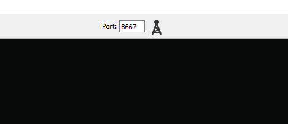
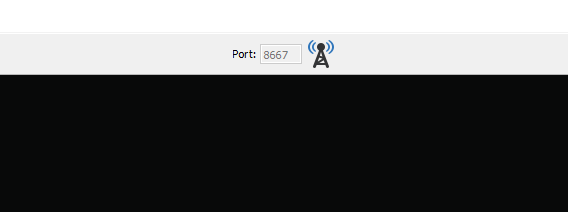
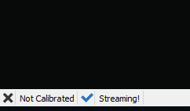
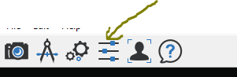

# Scripts for data collection with faceware live-server

This repository contains scripts for evenet dataset collection. 
## Getting Started
The repo contains the following scripts.
1. Teleprompter server - This script provides server for web based teleprompter 
2. Faceware live server client - A client which subscribes for live server blendkeys
3. Interface server - A server which listens from teleprompter and communicates with the client
to save transcriptions from teleprompter and blendkeys from client. 

### Prerequisites

* python 2

### Configuration 
Before running the data-collector scripts one should configure for required options of config.json file inside Teleprompter folder
**Config options** 
*   LiveIP                  : IP address of Faceware live server
*   LivePORT                : Port number of Faceware live server,
*   collector_server_ip     : IP address of collector server,
*   collector_server_port	: IP address of collector client
#### Configuring Faceware live server streaming.
Faceware Live automatically tracks video of a performer’s face to stream realtime animation shape keys using tcp protocol. To record this streaming live server allows to set port number to subscribe. Enabling streaming is done by clicking streaming icon found on top center if live server window.  
   
When the streaming is enabled the icon changes to the following icon  
   
and "Streaming!" message appears on bottom left corner of the window.  
  
Values of the animation shape keys can be view using "Animation Tuning" menu of menubar.

### Running the data collector script
All scripts can be run using the following script command

```python data_collector.py```

The collected dataset will be saved inside `Teleprompter/data` folder.